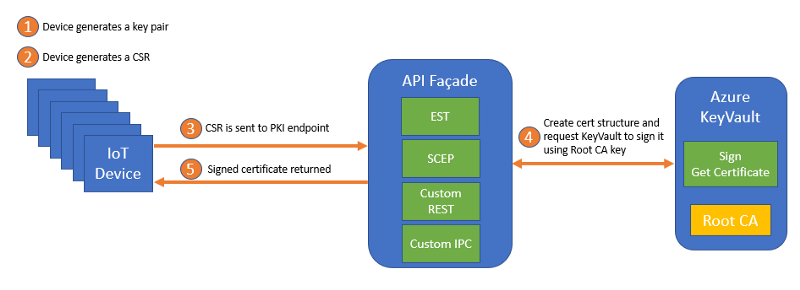

# Some Context

Please refer to [this blog post](https://vslepakov.medium.com/build-a-lightweight-pki-for-iot-using-azure-keyvault-acc46bce26ed) for details.  



# Getting Started

Clone this repo and then ```cd KeyVaultCA``` 

## Prerequisites

1. Create Azure KeyVault:  
```az keyvault create --name <KEYVAULT_NAME> \```  
```--resource-group keyvault-ca \```  
```--enable-soft-delete=true \```  
```--enable-purge-protection=true```  

## Setup KeyVault access for the API façade

1. Create a Service Principal in AAD  
```az ad sp create-for-rbac --name <SP_NAME> --skip-assignment=true```  
You will get an output containing ```appId``` and ```password```, please note them for later.

2. Give the Service Principal accesss to KeyVault keys and certificates:  
```az keyvault set-policy --name <KEYVAULT_NAME> \```  
```--spn <YOUR_APPID> \```  
```--key-permissions sign \```  
``` --certificate-permissions get list update create```  

## Generate a new Root CA in KeyVault

1. Run the API Facade like this (feel free to use your own values for the subject):  
```dotnet run --appId <YOUR_APPID> --secret <YOUR_APP_SECRET> \```  
```--ca --subject="C=US, ST=WA, L=Redmond, O=Contoso, OU=Contoso HR, CN=Contoso Inc" \```  
```--issuercert <NAME_OF_ROOT_CA> --kvName <KEYVAULT_NAME>```  

## Request a new device certificate

1. First generate the private key:  
```openssl genrsa -out mydevice.key 2048```  

2. Create the CSR:  
```openssl req -new -key mydevice.key -out mydevice.csr```  
```openssl req -in mydevice.csr -out mydevice.csr.der -outform DER```

3. Run the API Facade and pass all required arguments:   
```dotnet run --appId <YOUR_APPID> --secret <YOUR_APP_SECRET> \```  
```--issuercert <NAME_OF_ROOT_CA> --csrPath <PATH_TO_CSR_IN_DER_FORMAT> \```  
```--output <OUTPUT_CERTIFICATE_FILENAME> --kvName <KEYVAULT_NAME>```

## Use the [EST](https://tools.ietf.org/html/rfc7030) Facade to request a certificate

DISCLAIMER: NOT all of the the EST methods are implemented. It is only:
- [/cacerts](https://tools.ietf.org/html/rfc7030#section-4.1)
- [/simpleenroll](https://tools.ietf.org/html/rfc7030#section-4.2)

The endpoints above are used by and work with Azure IoT Edge 1.2 which supports certificate enrollment via EST.  

Build and deploy (or run in container) the ```KeyVaultCA.Web``` project.  
You need to provide the following environment variables:  
  
1. ```Secret``` - the service principal secret to access the KeyVault (see ```YOUR_APP_SECRET``` above).  
2. ```AppId``` - the app id of the service principal to access the KeyVault (see ```YOUR_APPID``` above).  
3. ```KeyVaultName``` - name of your KeyVault.  
4. ```IssuingCA``` - name of the certificate in the KeyVault to issue your leaf certificate (same as ```NAME_OF_ROOT_CA``` above).  
5. ```CertValidityInDays``` - specifies validity period for issued certificates.  
6. ```AuthMode``` - Authentication mode for the EST API. Possible values are: 
- **Basic** - add the following environment variables: 
    - ```EstUser``` - username for the EST enpoint
    - ```EstPassword``` - password for the EST endpoint 
- **x509** - via certificates
    - put your trusted CA certificates into the ```KeyVaultCA.Web\TrustedCAs``` folder. Make sure to specify CopyToOutput. Note that certificates downloaded from Azure Key Vault are by default encoded as a base64 string.  
   -  if you choose to publish the ```KeyVaultCA.Web``` app to an Azure App Service Plan, make sure to go to **Configuration** -> **General Setttings** -> **Incoming client certificates** -> set **Client certificate mode** to `Require`.


The implementation returns IssuingCA via the ```/cacerts``` endpoint.  
Refer to [this repo](https://github.com/arlotito/iot-edge-1.2-tpm) for details on IoT Edge configuration, including PKCS#11 and EST.