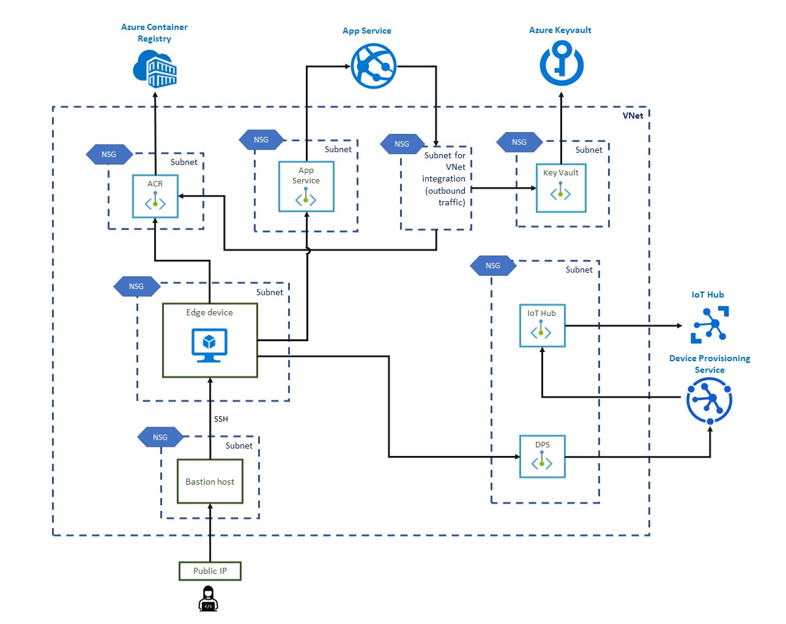

## Infrastructure as code

The Terraform scripts listed under the `terraform` directory can be used to deploy the infrastructure required for E2E testing to an Azure environment. This deployment includes an App Service for the EST server to run in using an image pulled from Azure Container Registry, an Azure Key Vault for storing the Root CA and an IoT Hub, Device Provisioning Service and a Linux VM simulating an IoT Edge device. The Terraform template uses `dotnet run` to execute the API Facade Console App, hence installing the [.NET Runtime 6](https://dotnet.microsoft.com/en-us/download/dotnet/6.0) is required. The infrastructure can be deployed by cd'ing into the `terraform` directory and then running `terraform init` followed by `terraform apply`. Terraform will use the [logged in Azure user credentials](https://registry.terraform.io/providers/hashicorp/azurerm/latest/docs/guides/azure_cli) and subsequent subscription to deploy the resources to.

### VNet integration

The Azure resources deployed through Terraform include VNet integration and private endpoints where possible. The architecture of this setup is shown in the image below. If the user wants to deploy the infrastructure without these resources, it is possible to remove the `terraform/private-endpoints` directory (together with all its subdirectories) and remove/comment out the corresponding module declarations in `terraform/main.tf`.



### Disabling public network access
When reusing these Terraform scripts, please be informed that public network access for ACR, Device Provisioning Service and Key Vault is enabled while running the scripts. This is necessary to configure the resources properly (i.e. downloading the certificate from Key Vault and then uploading to DPS) from the (local) machine where the scripts are executed. Public network access is then disabled for each service using Azure CLI commands as the last step of the deployment.

## Authenticating to the EST server using certificates

### Terraform
The authentication mode is currently set to be `x509`, which means using certificates for authenticating to the EST server.

If you want to use `Basic` authentication with username and password, then you would need to replace the default value of `auth_mode` within `/terraform/variables.tf` from `"x509"` to `"Basic"` and ensure that the `[cert_issuance.est.auth]` section in `cloud-init.yaml` looks like this:
```
      [cert_issuance.est.auth]
      username = "${EST_USERNAME}"
      password = "${EST_PASSWORD}"
      
      #identity_cert = "file:///etc/aziot/estauth.pem"
      #identity_pk = "file:///etc/aziot/estauth.key.pem"
```